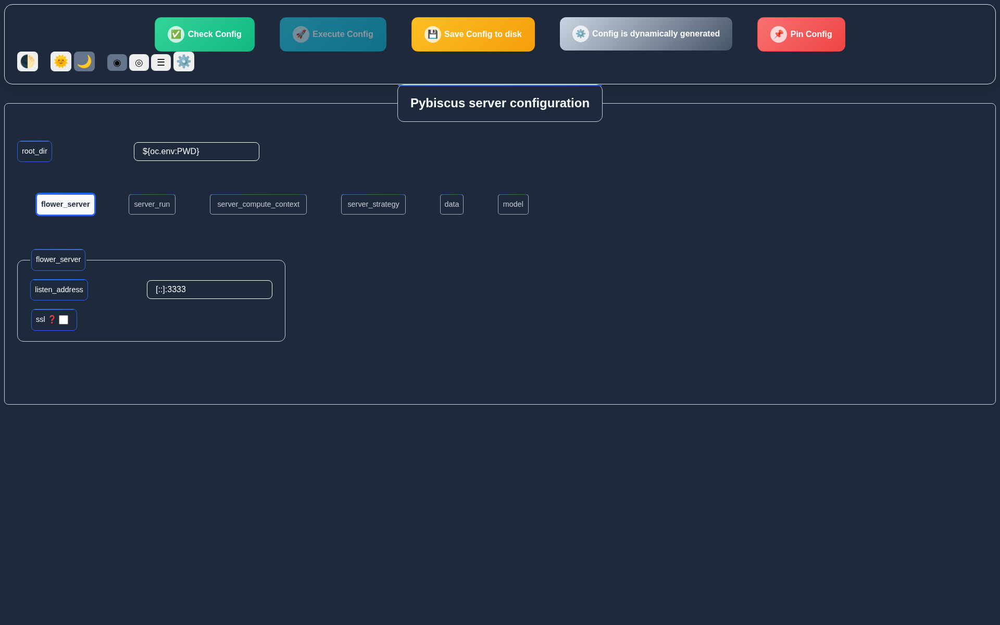
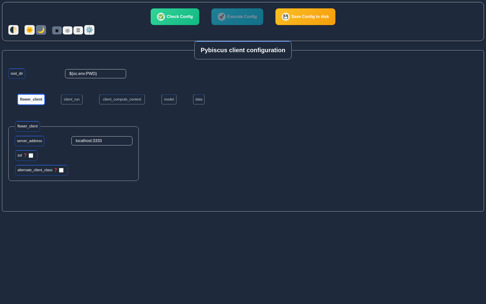
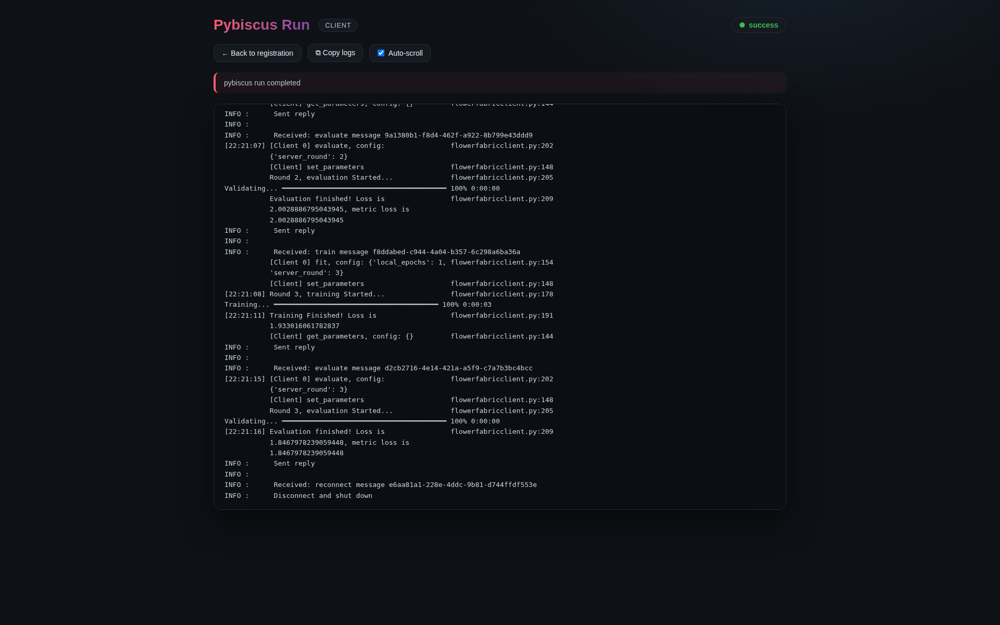

# Agent: configuring and launching from the browser

Install Pybiscus first ([Getting started](getting_started.md#installation)).

The agent (`pybiscus_agent`) is a small web application, one per site: it generates the server or
client configuration form from the configuration models (every plugin included, every field
described on hover), checks the configuration and launches the server or the client. It can be
used alone, as below, or driven by the session manager
([Session using the manager](sessionmanager.md)).

Launch the server agent, then open the URL it prints (`http://localhost:5000/server/config`,
with `?token=…` when it requires one):

```bash
./launch/agent/cli/5000.sh
```



Launch the client agents, and open `http://localhost:5001/client/config` and
`http://localhost:5002/client/config`:

```bash
./launch/agent/cli/5001.sh
./launch/agent/cli/5002.sh
```



On each form:
- **Check Config** validates the configuration; **Execute Config** (enabled once it is checked)
  launches the server or the client. Launch the server first, then the clients.
- **Save Config to disk** downloads the YAML file, to use with the [CLI](cli.md).
- On the server: **Pin Config** keeps the current form for the next visits, **Blank Config**
  returns to the defaults; an indicator shows where the displayed configuration comes from.
- The ⚙ panel sets the display (tabs, compact lists, theme).

Once launched, the page switches to the run monitor: the run's state and its log lines, live,
with a button to stop it.



The agent listens on 127.0.0.1 by default; see [Access tokens](sessionmanager.md#access-tokens)
and [Session spread over several machines](multi-machine.md) to reach it from elsewhere.
