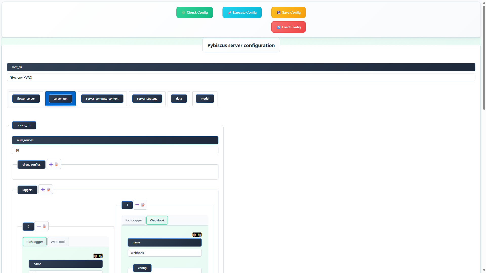

### Agent : lightweight client Mode

## Install Pybiscus
After cloning the repo and installing (via uv) all dependencies, you have to extend your PATH with the command:
```bash
source ./extend_path.sh
```

Lightweight client-based configuration: Server and client setup can now be performed using a local webapp. On each participating site, one simply launches pybiscus-agent and accesses the local web interface to configure and start federated learning participants.

In any case, you can export the yaml configuration file by pressing the <span style="color: orange;">💾 Save Config</span> button in order to use it in CLI mode, or for a new GUI session with the <span style="color: red;">🔄 Load Config</span> button _(not yet implemented)_.


launch the server agent :

```bash
 ./launch/agent/cli/5000.sh
```

then connect to http://localhost:5000/server/config



launch the client1 agent :

```bash
 ./launch/agent/cli/5001.sh
```

then connect to http://localhost:5001/client/config


launch the client2 agent :

```bash
 ./launch/agent/cli/5002.sh
```

then connect to http://localhost:5002/client/config


Finally run the 3 pybiscus components (server first, then clients) by launching the actions : Check Config, Execute Config
An indicator states the result of each action.

Each Pybiscus component outputs logs to the terminal associated with its respective agent.