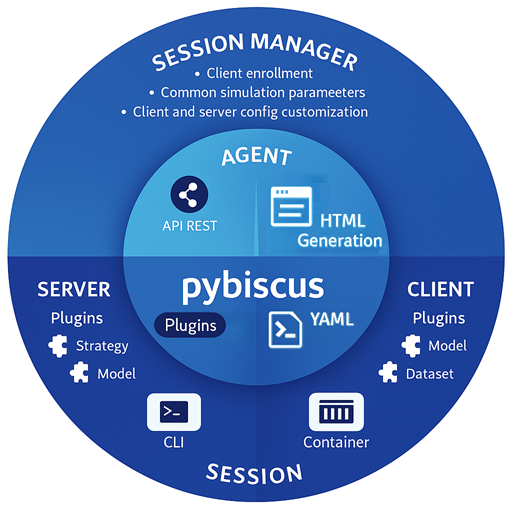

# Pybiscus

A simple tool to perform Federated Learning on various models and datasets. Build on top of Flower (FL part), Typer (script and CLI parts), Pydantic (configuration files management), and Lightning/Fabric (ML part).

## Key features

* a **Command Line Interface** built on Typer: to launch a server or a client, it is as simple as invoking the pybiscus app! Everything needed is written in config files, as you can find in the configs directory. **No code to change, juste YAML files!** [Let's use the CLI](cli.md)
* a **web-based agent** that provides an interactive interface for configuring and launching pybiscus from your browser. **No YAML files to write, just click !** [Let's use the agents](agent.md)
* a **session manager** that ensures parameter consistency across agents and synchronizes them throughout the various stages of a federated learning session. [Let's use the session manager](sessionmanager.md)
* all thing related to the Machine Learning parts is handled by Lightning and Fabric, cornerstones of the PyTorch ecosystem. This allows to separate the "Federated" part (i.e. senfin/receiving/aggragating the weights; done by FLower) from the specifics of the models and the data themselves. The Flower part is as much as possible agnostic from the ML part.
* The new **Plugin** support now enables external models and datasets usage, promoting modularity. Previously internal models and datasets components have been moved to a plugin library.
* Extended configurability beyond just datasets and models. It now also covers *strategies*, *metric loggers*, *loggers*, and more to come — all enabled through the use of Factory and Strategy design patterns, combined with hook definitions integrated into the Pybiscus codebase.
These hooks aim to make the code as generic and extensible as possible, allowing seamless customization and integration of new behaviours. [Let's have a look at plugins](plugins.md)

*For instance, the Server component logs all losses and metrics reported by the Clients (during both the fit and evaluate phases). It also logs the loss and metrics computed by the Server itself when a global test dataset is provided, ensuring proper monitoring of the Federated Learning session’s progress.
Previously, metrics were logged exclusively via TensorBoard. Now, the logging system is configurable: metrics can be sent either to TensorBoard or to an external webhook. This mechanism is designed to be easily extensible, allowing future integration with other logging tools (WandB, ...) .*

* the final model is saved on the Server side
* the structure of the code is meant to be as modular as possible. If you need to add other datasets and/or models, please have a look at [how-to](how-to.md).
