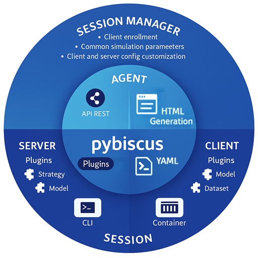

# Pybiscus

A tool to perform Federated Learning on various models and datasets. Built on top of Flower (FL
part), Typer (CLI), Pydantic (configuration files) and Lightning/Fabric (ML part).

## Installation

Pybiscus needs Python 3.12 or later and the [uv](https://docs.astral.sh/uv/) package manager,
which installs the right Python by itself (`.python-version`). From a clone of the repository:

```bash
uv sync                    # creates .venv and installs the dependencies (uv.lock)
source ./extend_path.sh    # adds ./bin to the PATH: the pybiscus command
pybiscus --help
```

Run the commands and the launch scripts from the repository root: the configurations and the
plugin manifest use paths relative to it. The datasets of the demos (cifar10, mnist) are
downloaded into `datasets/` on first use.

## Three ways to run it

* a **Command Line Interface**: a server and its clients launched from YAML configuration files
  (`configs/`), each in its own process. **No code to change, just YAML files!**
  [Let's use the CLI](cli.md)
* a **web agent** on each site, which generates the configuration forms from the configuration
  models and launches the server or the client from the browser.
  **No YAML files to write, just click!** [Let's use the agents](agent.md)
* a **session manager**, which registers the agents, sets the parameters shared by a session
  (model, data, how the data is shared, minimum number of clients, robustness...) in their forms,
  and follows the session (logs, metrics, charts). [Let's use the session manager](sessionmanager.md)

## Key features



* Everything related to Machine Learning is handled by Lightning and Fabric: the federated part
  (sending, receiving and aggregating the weights, done by Flower) stays agnostic of the models
  and the data.
* **Plugins**: models, datasets, strategies, strategy decorators, clients, loggers, metrics
  loggers... are discovered at start-up, from the bundled `pybiscus-plugins/` or from external
  projects. [Let's have a look at plugins](plugins.md)
* **Strategies**: Flower's FedAvg in the core, and Flower's other server strategies (FedProx,
  FedAdam, Krum, Bulyan...) as plugins; defenses against malicious clients
  ([Robust aggregation](robust-aggregation.md)), server-side differential privacy, privacy
  evaluation ([FedMIA](privacy-evaluation.md)).
* **Data shared between the clients** by configuration (iid, dirichlet, shards), validation sets
  held out of each client's share, reproducible runs (seeds).
* **Logging**: the server logs every client's metrics and its own evaluation, to files, TensorBoard,
  Weights & Biases or the session manager ([Logging](logging.md)); it saves the final model, and
  can export it to ONNX.
* **Campaigns** compare strategies on short federated runs ([Campaigns](campaigns.md)).
* To add datasets or models, see [how-to](how-to.md) and the [integration guide](pybiscus_model_guide.md).
