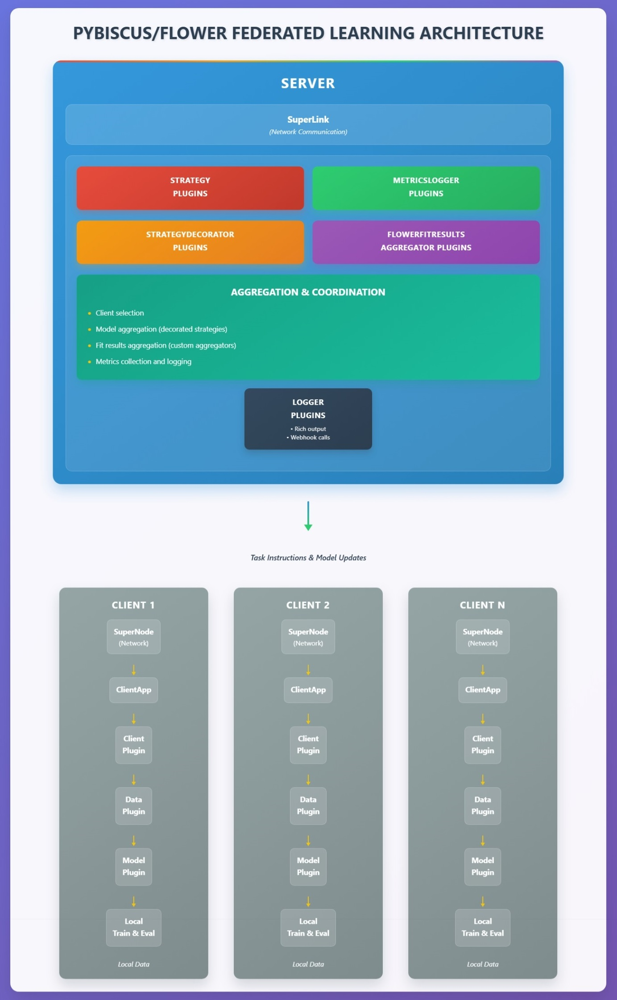

# Welcome to Pybiscus!

You can find here a short documentation on how to use and adapt Pybiscus. The tool is aimed at being modular and as simple as possible.

## Contents

### Using Pybiscus

* [Getting started](getting_started.md) - installation and the three ways to run Pybiscus
* [Command line interface](cli.md)
* [Agent: lightweight client](agent.md)
* [Session using the manager](sessionmanager.md)
* [Session spread over several machines](multi-machine.md)
* [Config files](configuration.md)
* [Containers](containers.md)
* [Logging and Tensorboard](logging.md)

### Extending Pybiscus

* [Plugins](plugins.md)
* [How-to: add models and datasets](how-to.md)
* [Model integration guide](pybiscus_model_guide.md)
* [Developer guide](developper-guide.md)

### Federated learning topics

* [Campaigns: comparing strategies on short federated runs](campaigns.md)
* [Robust aggregation against malicious clients](robust-aggregation.md)
* [Privacy evaluation: FedMIA](privacy-evaluation.md)

## Project layout

Here are the main directories of the Pybiscus project:

* the **pybiscus** directory - the sources of the Pybiscus project :
    * **pybiscus/flower** contains new implementation of Client, Server and Strategies provided by Flower, using Fabric in order to be agnostic to hardware, precision and the like.
    * **pybiscus/ml** may host data and models, but the recommanded way is in **pybiscus-plugins** (see how-to for plugin development).
    * **pybiscus/commands** the source of the CLI pybiscus-core.
    * **pybiscus/session/agent** the sources of pybiscus-agent lightweight client.
    * **pybiscus/session/manager** the sources of pybiscus-agent lightweight client.
* the **pybiscus-plugins** directory and its associated **pybiscus-plugins-conf.yml** configuration file : examples of Pybiscus extensions.
* **configs** contains only YAML configuration files. In order to change the behaviour of your client, model etc, do not change the code - change the config!
* **container** everything related to the build of docker/podman images.
* **launch** scripts to launch session, either inline with uv or using containers, with variations on the used models, network configuration, ssl optional usage ...
* **pybiscus/main.py** the entrypoint of Pybiscus. Gather all three main commands: server, client and local-train.
* **docs** last but not least, the present documentation

We strongly suggest to create some other directories:

* **experiments** to hold checkpoints, tensorboards and such.
* **datasets** this is self explanatory!
