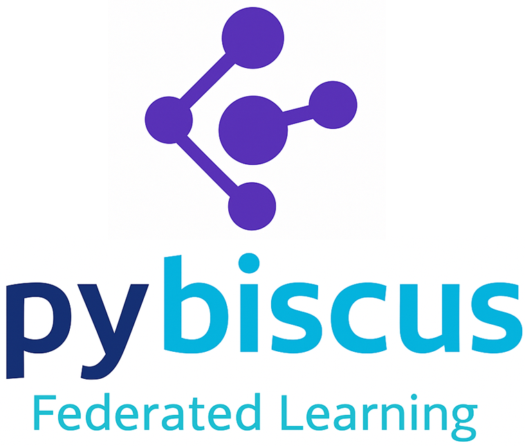
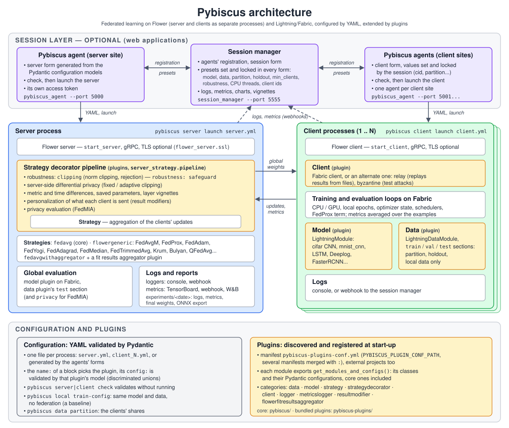

# Welcome to Pybiscus!

You can find here a short documentation on how to use and adapt Pybiscus. The tool is aimed at being modular and as simple as possible.

## Contents

### Using Pybiscus

* [Getting started](getting_started.md) - installation and the three ways to run Pybiscus
* [Command line interface](cli.md)
* [Agent: lightweight client](agent.md)
* [Session using the manager](sessionmanager.md)
* [Session spread over several machines](multi-machine.md)
* [Config files](configuration.md)
* [Containers](containers.md)
* [Logging and Tensorboard](logging.md)

### Extending Pybiscus

* [Plugins](plugins.md)
* [How-to: add models and datasets](how-to.md)
* [Model integration guide](pybiscus_model_guide.md)
* [Developer guide](developper-guide.md)

### Federated learning topics

* [Campaigns: comparing strategies on short federated runs](campaigns.md)
* [Robust aggregation against malicious clients](robust-aggregation.md)
* [Privacy evaluation: FedMIA](privacy-evaluation.md)

## Project layout

Here are the main directories of the Pybiscus project:

* the **pybiscus** directory - the core of Pybiscus:
    * **pybiscus/commands** the commands of the `pybiscus` CLI (`server`, `client`, `local`, `data`).
    * **pybiscus/flower**, **pybiscus/flower_fabric** the server and client sides on Flower, using
      Fabric to be agnostic to hardware: the core `fedavg` strategy and the base of the Flower
      strategies (`flowerstrategy.py`), the client, the strategy decorators' interfaces.
    * **pybiscus/flower_config** the Pydantic models of the server and client configurations.
    * **pybiscus/ml** the training and evaluation loops, and the data sections shared by the data
      plugins (`datasplit.py`); data and models themselves are plugins.
    * **pybiscus/plugin** the plugin manager and the registries.
    * **pybiscus/pydantic2xxx** the generation of the agents' forms (and texts) from the configuration
      models.
    * **pybiscus/session/agent** the sources of the agent (`pybiscus_agent`).
    * **pybiscus/session/manager** the sources of the session manager (`session_manager`).
* the **pybiscus-plugins** directory and its manifest **pybiscus-plugins-conf.yml**: the bundled
  plugins (data, models, strategies, decorators...).
* **configs** YAML configuration files. To change the behaviour of your client, model etc, do not
  change the code - change the config!
* **container** everything related to the build of docker/podman images.
* **launch** scripts to launch sessions, inline with uv or in containers, the agents and the
  session manager; **launch/campaign** the campaign tool (see [Campaigns](campaigns.md)).
* **certificates** the scripts generating the SSL certificates.
* **pybiscus/main.py** the entrypoint of the `pybiscus` command.
* **docs** last but not least, the present documentation.

We strongly suggest to create some other directories:

* **experiments** to hold checkpoints, tensorboards and such.
* **datasets** this is self explanatory!
