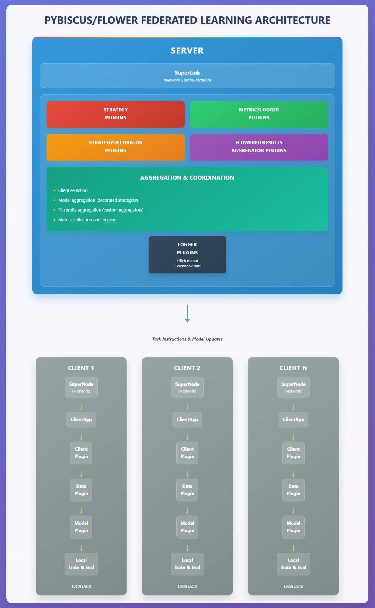

# Plugins information

Their source code can be located in several locations according to their type: 
- in a specific package pybiscus source tree (for those of general interest)
- in their specific source tree, referenced by category in the plugin definition yaml file. 
Meaning you have the ability to embed code originating from an external repository.

They shall implement an interface defined in *pybiscus.interfaces* package.
Their package shall provide a specific entry point *get_modules_and_configs()* in its *__init__.py* file that is checked at launch for a run-time discovery. [More technical info in How-to](how-to.md)

Abbreviated packages representation used in the following array :
- ⚡.🔥 lightning.pytorch
- 🌺.🤖 pybiscus\.ml
- 🌺.🌼 pybiscus.flower
- 🌺.🔘 pybiscus.core
- 🌺.🔌.🔘 pybiscus.interfaces.core
- 🌺.🔌.🌼 pybiscus.interfaces.flower

|Implemented interface|Source tree location|Plugin type definition|
|:--------------------|:-------------------|:--------------------:|
|⚡.🔥.LightningDataModule|🌺.🤖.data|data|
|⚡.🔥.LightningModule|🌺.🤖.models|model|
|🌺.🔌.🔘.metricsloggerfactory.MetricsLoggerFactory|🌺.🔘.metricslogger|metricslogger|
|🌺.🔌.🔘.logger.LoggerFactory|🌺.🔘.logger|logger|
|🌺.🔌.🌼.fabricstrategyfactory.FabricStrategyFactory|🌺.🌼.strategy|strategy|
|🌺.🔌.🌼.strategydecorator.StrategyDecorator|🌺.🌼.strategydecorator|strategydecorator|
|🌺.🔌.🌼.clientfactory.ClientFactory|🌺.flower_fabric.client|client|
|🌺.🔌.🌼.flowerfitresultsaggregator.FlowerFitResultsAggregator|🌺.🌼.flowerfitresultsaggregator|flowerfitresultsaggregator|

