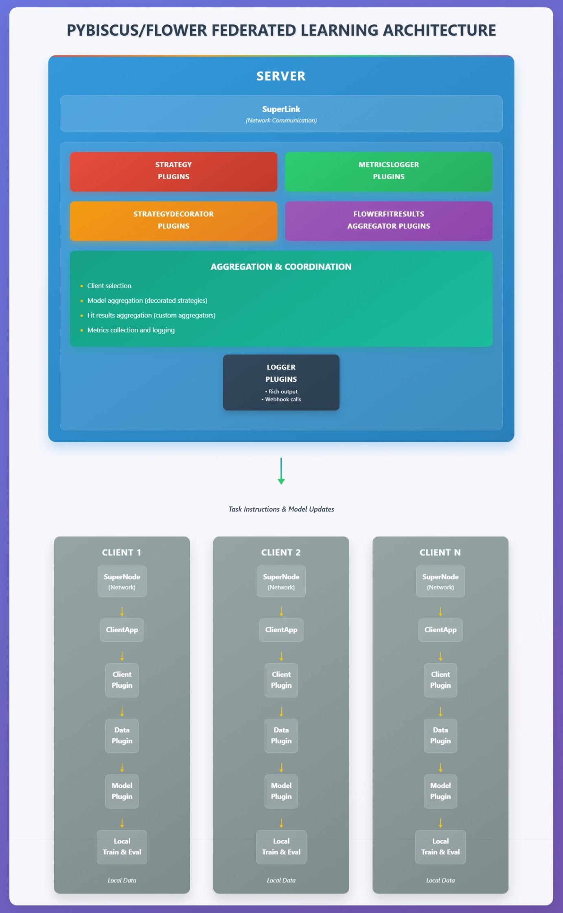

# Plugins information

# Plugin Development

## Model and Data Provider Development

For detailed instructions on creating custom models and data providers, refer to the [PyBiscus Integration Guide](pybiscus_model_guide.md).

This document covers plugin directory structure and registration mechanisms...




Their source code can be located in several locations according to their type: 
- in a specific package pybiscus source tree (for those of general interest)
- in their specific source tree, referenced by category in the plugin definition yaml file. 
Meaning you have the ability to embed code originating from an external repository.

They shall implement an interface defined in *pybiscus.interfaces* package.
Their package shall provide a specific entry point *get_modules_and_configs()* in its *__init__.py* file that is checked at launch for a run-time discovery. [More technical info in How-to](how-to.md)

Abbreviated packages representation used in the following array :
- ⚡.🔥 lightning.pytorch
- 🌺.🤖 pybiscus\.ml
- 🌺.🌼 pybiscus.flower
- 🌺.🔘 pybiscus.core
- 🌺.🔌.🔘 pybiscus.interfaces.core
- 🌺.🔌.🌼 pybiscus.interfaces.flower

|Implemented interface|Source tree location|Plugin type definition|
|:--------------------|:-------------------|:--------------------:|
|⚡.🔥.LightningDataModule|🌺.🤖.data|data|
|⚡.🔥.LightningModule|🌺.🤖.models|model|
|🌺.🔌.🔘.metricsloggerfactory.MetricsLoggerFactory|🌺.🔘.metricslogger|metricslogger|
|🌺.🔌.🔘.logger.LoggerFactory|🌺.🔘.logger|logger|
|🌺.🔌.🌼.fabricstrategyfactory.FabricStrategyFactory|🌺.🌼.strategy|strategy|
|🌺.🔌.🌼.strategydecorator.StrategyDecorator|🌺.🌼.strategydecorator|strategydecorator|
|🌺.🔌.🌼.clientfactory.ClientFactory|🌺.flower_fabric.client|client|
|🌺.🔌.🌼.flowerfitresultsaggregator.FlowerFitResultsAggregator|🌺.🌼.flowerfitresultsaggregator|flowerfitresultsaggregator|

# Multi projects mode : developping plugins in separated projects

__The following guidelines, extracted from the _cypia_ plugin project, demonstrate how to structure your development environment so that the Pybiscus core and each plugin are maintained in their own dedicated project.__

This project is a suite of plugins for the Pybiscus federated learning framework:
https://github.com/ThalesGroup/pybiscus
which is itself based on the flower framework:
https://github.com/adap/flower

The intention is to enable a clear separation between the pybiscus core
and its plugins, in order to be able to use external code
without impacting the pybiscus core, particularly to have isolation
between pybiscus dependencies and those of its plugins.

This relies on the use of the uv tool (from Astral)

uv is an ultra-fast Python dependency and environment management tool, compatible with pyproject.toml standards, which replaces pip, pip-tools, virtualenv and setuptools install all at once.

We use the workspace concept for this,
which allows to logically group several projects and
produce a workspace virtual environment that is the fusion of the workspace projects.

## General organization

A workspace directory, in which we will clone the two repositories side by side:

```bash
mkdir workspace
cd workspace
git clone https://github.com/ThalesGroup/pybiscus
git clone https://my-plugin-repository-url/cypia
```

```
workspace/
├── pyproject.toml
├── pybiscus/
├── cypia/
```

## The cypia project structure

```
cypia/
├── .python.version
├── pyproject.toml
├── pybiscus.env
├── cypia-plugins-conf.yml
├── cypia/
│   └── __init__.py
├── workspace/
│   ├── init.sh
│   └── pyproject.toml
```

## The cypia project's pyproject.toml

The project has a dependency on the parent pybiscus project,
in addition to its own dependencies,
as well as an indication that it is part of a workspace:

```

dependencies = [
  "plugin-deps>=1.5.0",
  ...
  "pybiscus",
]

...

[tool.uv.sources]
pybiscus = { workspace = true }

```

## The pybiscus + cypia workspace pyproject.toml

The workspace/init shell must allow initializing the workspace

it copies the pyproject.toml file:

```
[tool.uv.workspace]
members = ["pybiscus", "cypia"]
```

```bash
#!/usr/bin/bash

cp pyproject.toml ..
cd ..
uv sync
```

## Plugin configuration

To specify the definition of the plugins used, you can configure the plugin configuration file (default file: **pybiscus-plugins-conf.yml**, but configurable via the **PYBISCUS_PLUGIN_CONF_PATH** environment variable) by overriding this variable in the **pybiscus.env** file with these 2 possibilities:

- override the plugin configuration file in order to use only the project plugins :

```
PYBISCUS_PLUGIN_CONF_PATH="./cypia-plugins-conf.yml"
```
- merge several plugin configuration files in order to use both the project plugins and the pybiscus ones :

```
PYBISCUS_PLUGIN_CONF_PATH="../pybiscus/pybiscus-plugins-conf.yml:./cypia-plugins-conf.yml"
```

## How to develop / execute

Once the workspace has been inited by executing the  workspace/init shell.

By positionning in the cypia directory,
we can access to pybiscus python packages,
and pybiscus shells can be ran using their relative path 
( by example: ../pybiscus/launch/agent/cli/5000.sh )
