# Session using the manager

## Install Pybiscus
After cloning the repo and installing (via uv) all dependencies, you have to extend your PATH with the command:
```bash
source ./extend_path.sh
```

The session manager ensures consistency across federation participants, handles registration, synchronization, and shared settings.

### Init of the session

launch the session manager :

```bash
./launch/session/run_manager.sh
```

connect to http://localhost:5555/pybiscus-session/manage

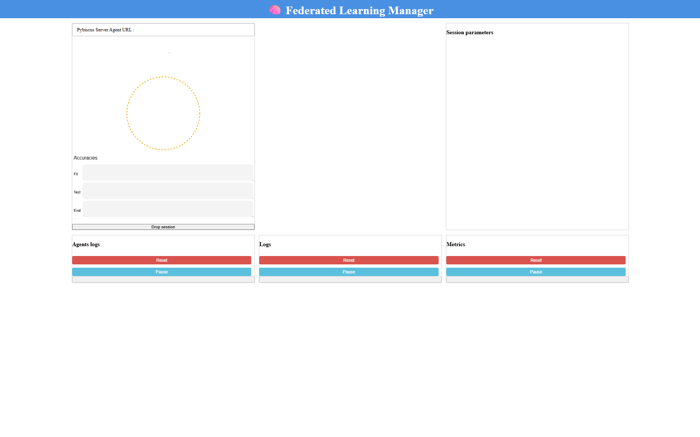

### Init of the agents

launch the server agent :

```bash
 ./launch/agent/cli/5000.sh
```

launch the client1 agent :

```bash
 ./launch/agent/cli/5001.sh
```

launch the client2 agent :

```bash
 ./launch/agent/cli/5002.sh
```

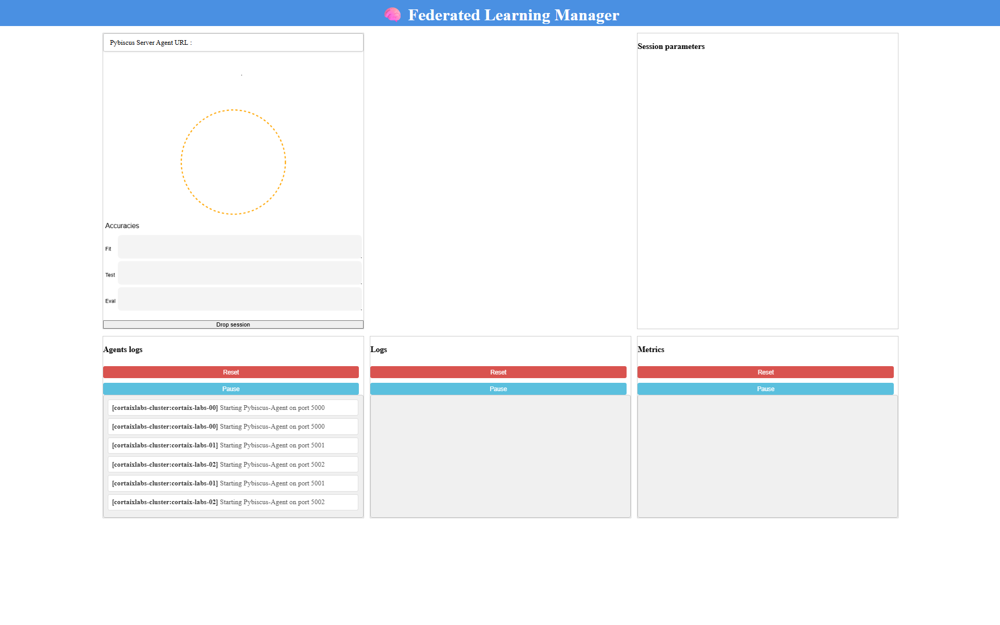

### Init of the session : server side

connect to http://localhost:5000/session/agent/registration

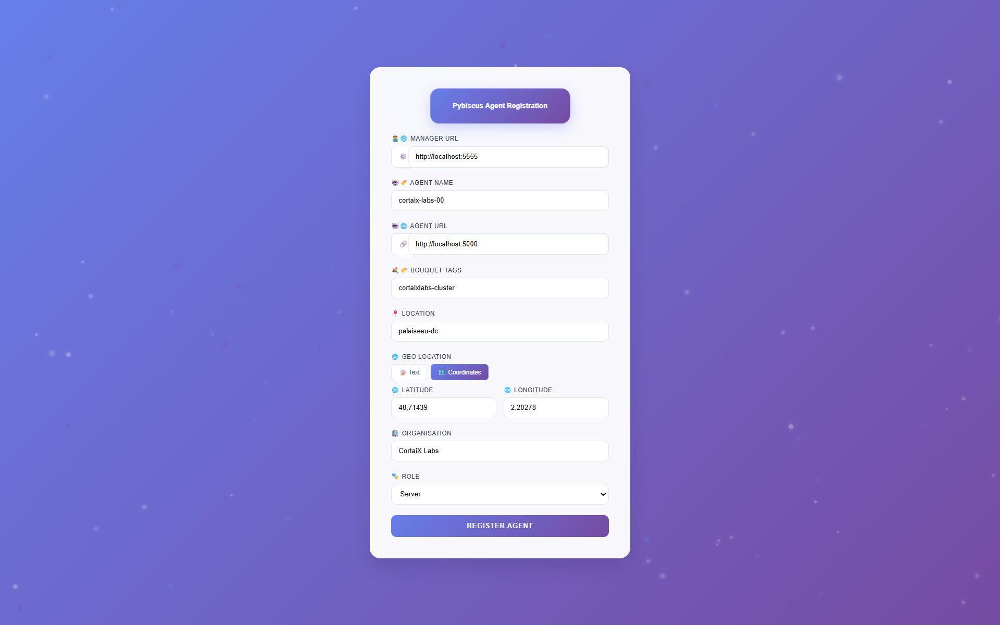

sets the parameters and register agent, it now waits for the session start

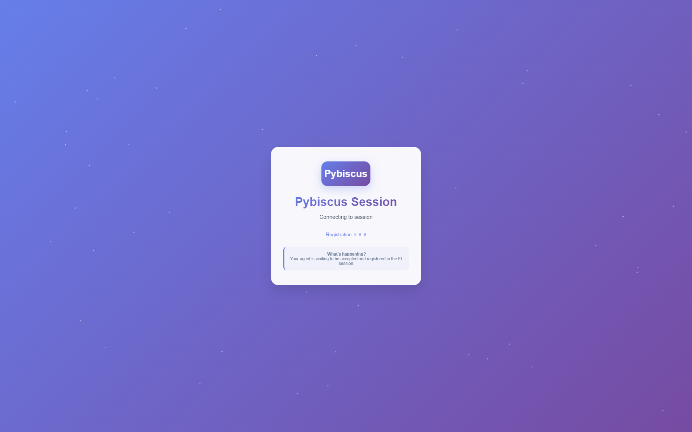


### Init of the session : client 1 side


connect to http://localhost:5001/session/client/registration

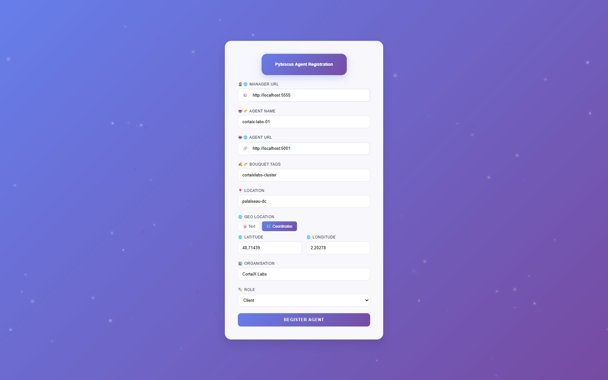

and the client 1 registers to the session

### Init of the session : client 2 side


connect to http://localhost:5002/session/client/registration

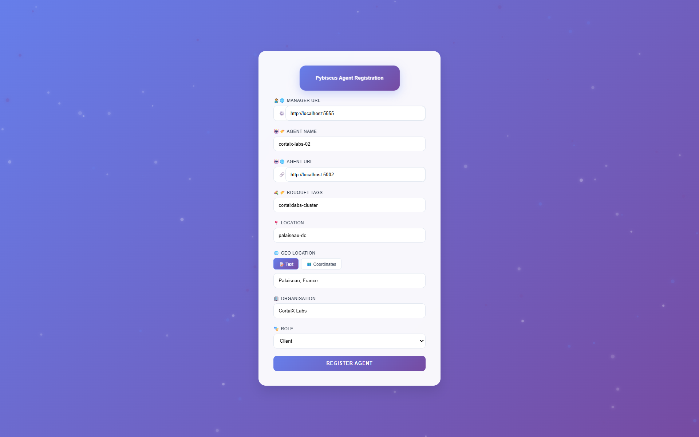

and the client 2 registers to the session

### Session shared parameters setting
 
As soon as the server is registered,
the manager connect to it in order to set the session common parameters
(flower server access, used data and model)

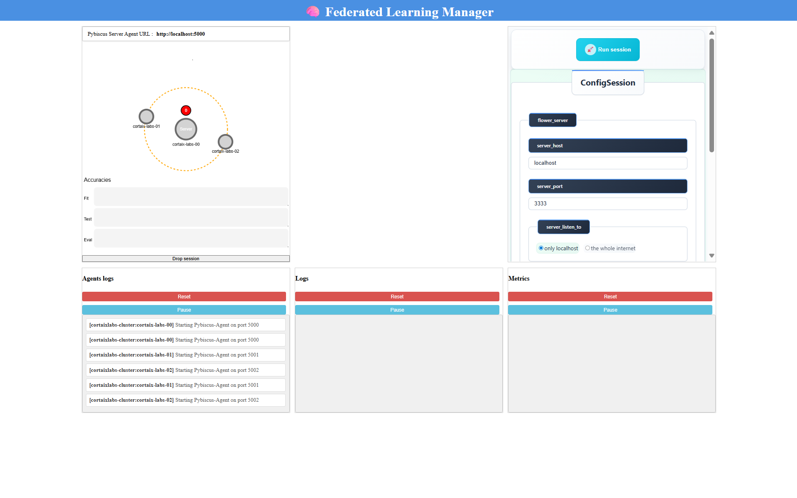

Proceed to the session common parameters definition, 
the server and clients will pass to the configuration phasis with the session common parameters set and locked (lock image in the field name)

For instance, configurate its metrics logging feature and logging feature to use a webhook :

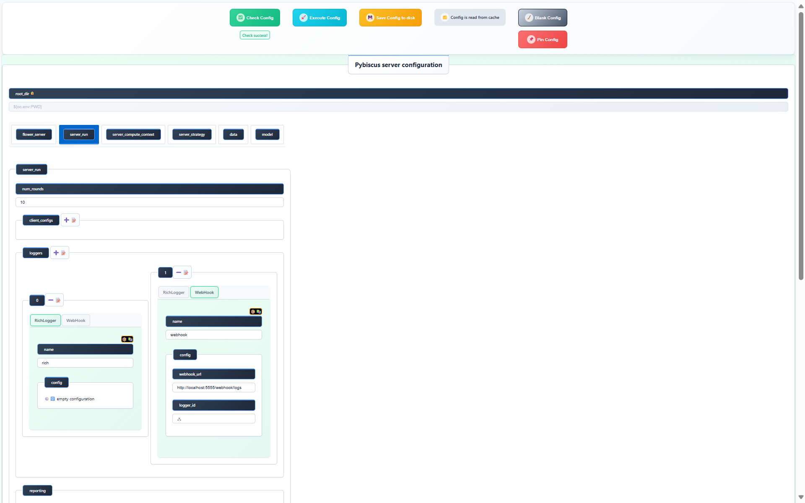

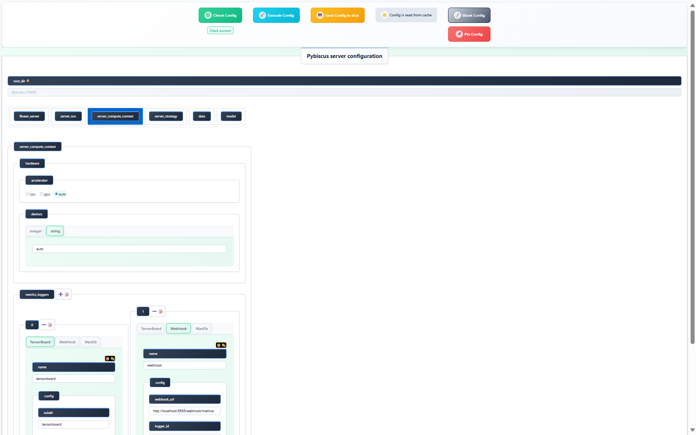

Check and Execute the server configuration.

### Session run : client 1 side

Check and Execute the client1 configuration.

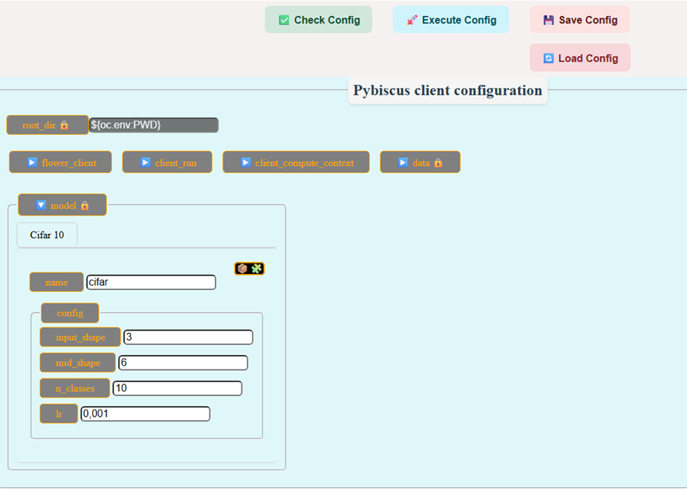

### Session run : client 2 side

Check and Execute the client2 configuration.

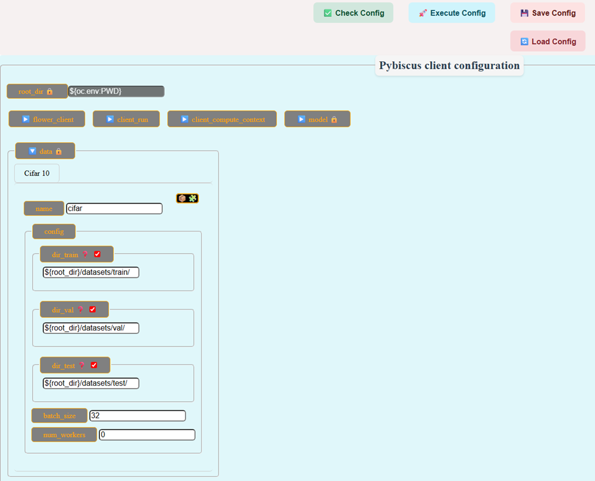

You can see directly the logs and metrics in the session manager, instead of having to look in each agent terminal (as we configurate them to the web-hook option).

### Session monitoring 

running session

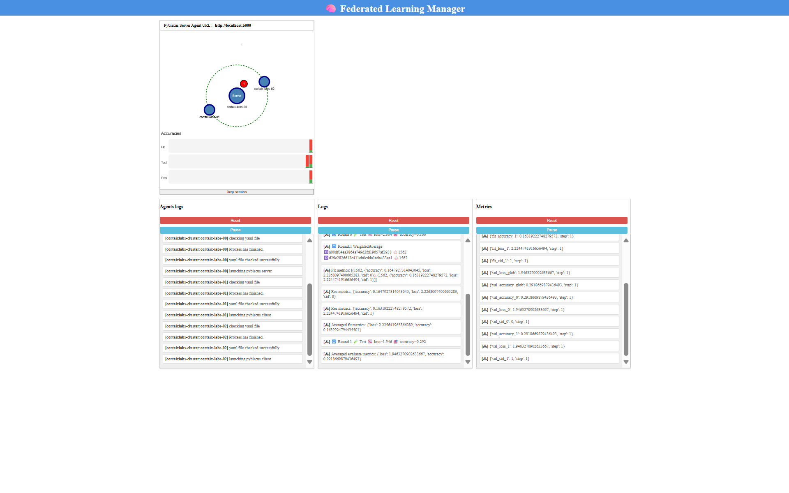

finished session

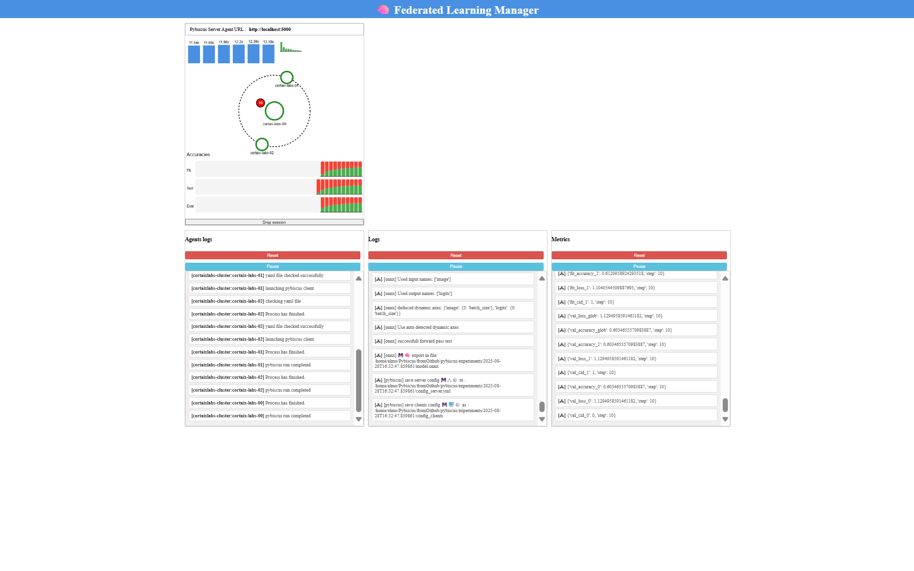
