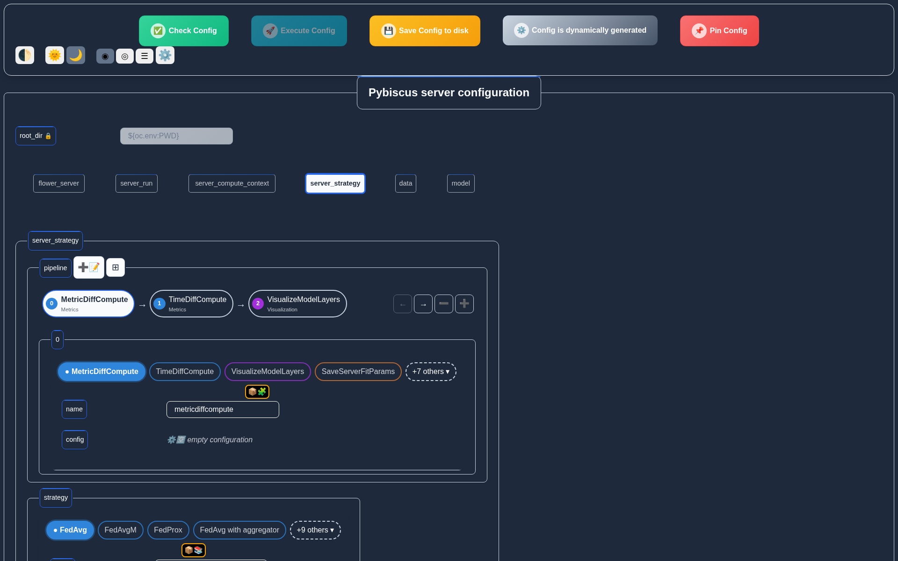
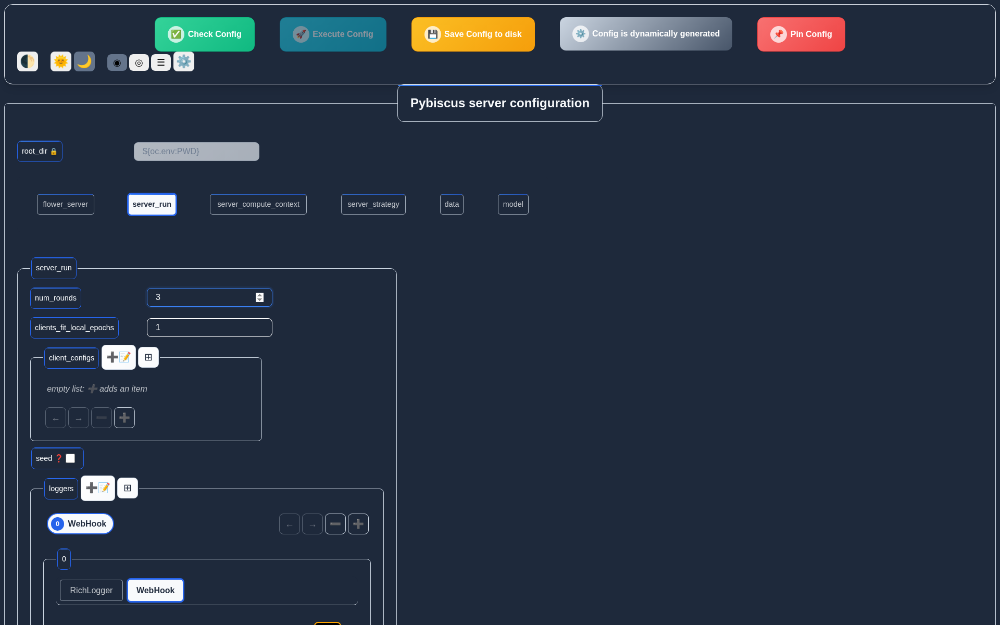
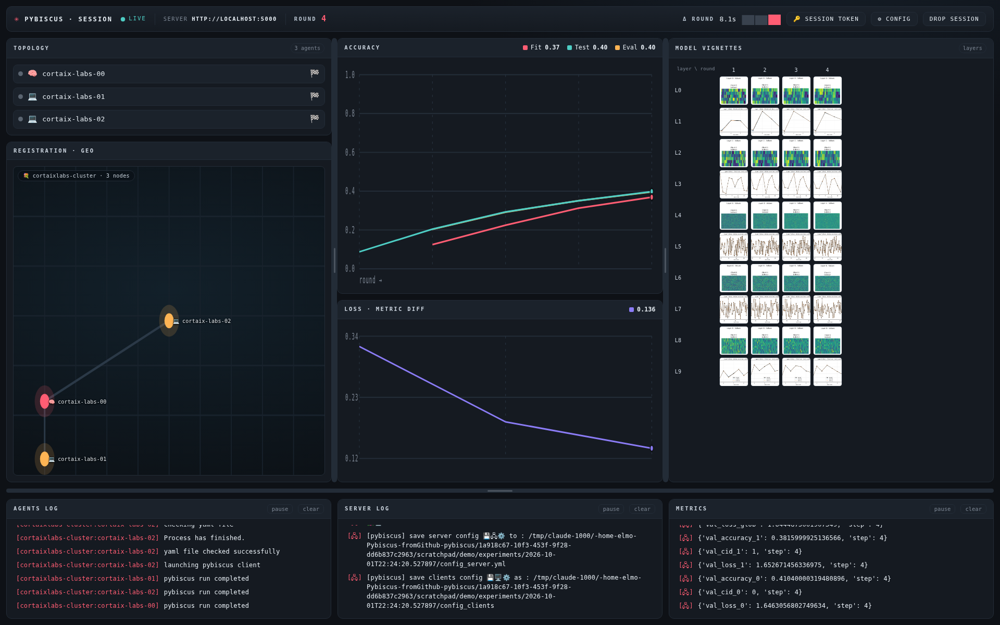

# Session using the manager

Install Pybiscus first ([Getting started](getting_started.md#installation)).

The session manager registers the agents of a session (one per site, see [Agent](agent.md)), sets
the parameters they share (model, data, how the data is shared, minimum number of clients,
robustness...) in their forms, locked, and follows the session: topology, charts, logs and metrics
of every participant in one page.

## Walkthrough

### 1. Start the manager

```bash
./launch/session/run_manager.sh
```

Open the URL it prints, `http://127.0.0.1:5555/pybiscus-session/manage` (with `?token=…` when it
requires one, see [Access tokens](#access-tokens)). The page is empty until agents register.


### 2. Start the agents

One agent per site: the server's, then the clients'.

```bash
./launch/agent/cli/5000.sh
./launch/agent/cli/5001.sh
./launch/agent/cli/5002.sh
```

Each agent reports to the manager when it starts (agents log, bottom left).


### 3. Register the agents

Open the registration page each agent prints, `http://127.0.0.1:500x/session/agent/registration`:
the manager's URL, the **session token** (proposed when the agent runs from the manager's
directory, otherwise copied from the manager's 🔑 *Session token* button), the agent's name,
its group (*bouquet*), location and role (*Server* for the agent 5000, *Client* for the others).
*Register agent* sends it to the manager; the agent then waits for the session to start.


The registered agents appear in the manager's topology and on its map.

### 4. Configure and run the session

Once the server agent is registered, the manager opens the session configuration (⚙ *Config*
button to reopen it). Its header gives the number of clients registered. Choose the model and the
data, and the optional session settings (described in [Session parameters](#session-parameters)):
how the training data is shared between the clients (`data_partition`), a validation set held out
of each share (`data_holdout`), `min_clients`, `robustness`, `share_cpu_threads`.


*Run session* sends these values to every agent: their forms open with them set and locked (🔒
on the field name).

### 5. Launch the server

The server's form opens with the session values locked: the strategy's `min_*_clients`, the
robustness decorator, the data and model choices and the partition fields. Its loggers and metrics
loggers default to the manager's webhook, so its logs and metrics appear in the manager. Set the
other values (number of rounds, strategy, pipeline...), then *Check Config* and *Execute Config*.





### 6. Launch the clients

Each client's waiting page opens its form once the server runs, with the server's address and the
session values set: its own share of the data (`partition_id`, `num_partitions`, its `cid`), the
holdout, its number of CPU threads. *Check Config* and *Execute Config*.


Every agent's page then switches to its run monitor (state, live log, stop button).


### 7. Follow the session

The manager shows, live:
- the topology (each agent's state, a 🏁 once its run has finished) and the map of the sites;
- the accuracy per round (clients' training, server's test, clients' evaluation) and the loss;
- the vignettes of the model's layers per round (from the `VisualizeModelLayers` decorator of the
  server's pipeline);
- the agents' and the server's logs, and the metrics.



*Drop session* ends the session and empties the page, for a new one with the same agents (which
register again).

## Session parameters

The session configuration (server agent) has an optional `data_partition` block: when set, the
manager shares the training data between the clients registered when the session is launched, each
client getting its `partition_id` (its rank) and the number of partitions, locked in its form, along
with a stable `cid` equal to that rank.

Its optional `data_holdout` block (`fraction`, `seed`) makes every client validate on examples
held out of its own training share: the manager sets and locks `val.source: holdout`, `val.fraction`
and `val.seed` in each client's form, late clients included (data plugins with a holdout: cifar,
mnist, hdfs; turbofan validates on its own engines and ignores it).

The manager also sets and locks the server strategy's `min_fit_clients`, `min_evaluate_clients`
and `min_available_clients`: every round waits for that many clients (Flower's default of 2 let a
session of 7 clients start with the first 2 to connect, and the robust aggregations size their
defense on that number). By default it is the number of clients registered at launch, shown in the
header of the session configuration; a client that leaves the session then stalls the next round
(Flower waits up to 24 h). The optional `min_clients` field of the session form sets another
number, and the manager asks for a confirmation stating the risk when it differs from the clients
registered:
- fewer: rounds start as soon as that many clients are connected, possibly without the others,
  and a robust aggregation sizes its defense on fewer clients; in exchange, the others may leave;
- more: the first round waits for the missing clients, and clients registered after the launch get
  no share of the data partition.

Its `robustness` choice (`none` by default, or `safeguard`) is set and locked in the server's form:
`safeguard` adds a defense against malicious clients to the server's pipeline (see
[Robust aggregation](robust-aggregation.md#the-robustness-setting)).

These session values are set in every option of the forms that has the field, not only in the
selected one: switching the strategy or the data plugin afterwards keeps them.

Its `share_cpu_threads` setting (on by default) shares the CPU of each machine between the clients
running on it: each agent tells the manager its machine and number of physical cores when it
registers, and each client gets `client_compute_context.num_threads` = cores / clients on its
machine (still editable in its form). The server gets none, since it never computes at the same
time as the clients; with several sessions on one machine, set `server_compute_context.num_threads`
by hand (see [CPU threads](configuration.md#cpu-threads)). Without it, every PyTorch client takes all the cores: three
cifar10 clients on a 14-core machine took 233 s per round instead of 20 s.

## Access

The manager listens on 127.0.0.1 by default. When agents run on other hosts (they send it their
registration and logs), start it with `--host 0.0.0.0` (or a given address), e.g.
`launch/session/run_manager.sh --host 0.0.0.0`. For a session spread over several machines, see
[multi-machine.md](multi-machine.md).

### Access tokens

A component listening beyond the loopback (`--host 0.0.0.0` or an address) requires tokens:
whoever reaches a port opened to the network must not drive the session nor launch runs. On
127.0.0.1 (the default), it requires none, unless started with `--require-token` (a machine shared
with other users). Each component decides for itself: a client agent on 127.0.0.1 requires no
token, while the manager and the server agent it registers with, listening on the network, do.
It prints at start either `🔑 … open …?token=…`, or `🔓 … no token required`.

- **Access token of a component**: the manager and each agent have their own, for their pages and
  actions. Each prints, when it starts, the URL to open (`…?token=…`); the browser then keeps it in a
  cookie, and the page asks for it otherwise. The manager's is its administration token (launch or
  drop the session, follow it).
- **Session token**: the manager's, given to the participants (created even when the manager
  requires none, since a server agent listening on the network requires it from the others). An agent gives it at its
  registration (field *Session token* of its registration page, copied from the manager's
  🔑 button); it then presents it to the manager (registration, session parameters, logs), passes
  it to the runs it launches (webhooks), and accepts it from the other components (a client's run
  configuration, the session form opened by the manager). It does not open the manager's pages.

A token is kept, readable by its owner only, in `.pybiscus-cache/tokens/` of the directory where
the component was started: a restart keeps it (the browsers stay logged in). Delete the file to get
a new one, or give it:

| component | option | environment variable | file |
|---|---|---|---|
| manager (administration) | `--admin-token` | `PYBISCUS_MANAGER_TOKEN` | `manager-<port>-admin` |
| manager (session) | `--session-token` | `PYBISCUS_SESSION_TOKEN` | `manager-<port>-session` |
| agent | `--token` | `PYBISCUS_AGENT_TOKEN` | `agent-<port>` |

On the manager's machine, the agents and the runs started from the same directory find the session
token in its file: the registration page proposes it, and the webhooks of a run launched by hand
present it. Elsewhere, give it at the registration, or through `PYBISCUS_SESSION_TOKEN` (a run
launched by hand whose webhooks target the manager, or the `session_token` key of an agent's
registration configuration).

A scripted call presents the token as `Authorization: Bearer <token>` (see below).

Without TLS, the tokens travel in clear between machines: see [multi-machine.md](multi-machine.md).

### Requests from other sites

A page of another site open in the operator's browser must not drive the agents or the manager.
Every request that changes something (POST, PUT, PATCH, DELETE) must therefore carry the header
`X-Pybiscus: 1`, otherwise it is refused with a 403; the actions (registration, session run, run of
an agent) are never triggered by a GET. Pybiscus' pages and components add the header; a scripted
call must add it too, with the agent's token when it requires one, e.g. (see `launch/agent/mngt/*.sh`):

```bash
TOKEN=$(cat .pybiscus-cache/tokens/agent-5000)
curl -X POST -H "X-Pybiscus: 1" -H "Authorization: Bearer $TOKEN" http://localhost:5000/server/config -F file=@server.yml
curl -X POST -H "X-Pybiscus: 1" -H "Authorization: Bearer $TOKEN" http://localhost:5000/server
```

The registration page of an agent calls the manager from the agent's origin: the manager accepts
such cross-origin calls from local origins (`localhost`, `127.0.0.1`, `[::1]`, any port) only. When
agents are opened from other hosts, allow their origins, one option per origin:

```bash
launch/session/run_manager.sh --host 0.0.0.0 --allow-origin http://site-a.example:5001
```

The header protects against other sites; the tokens (above) against whoever reaches the ports.
