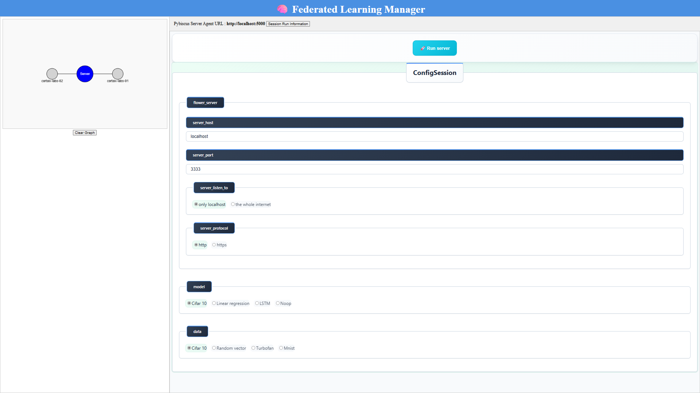
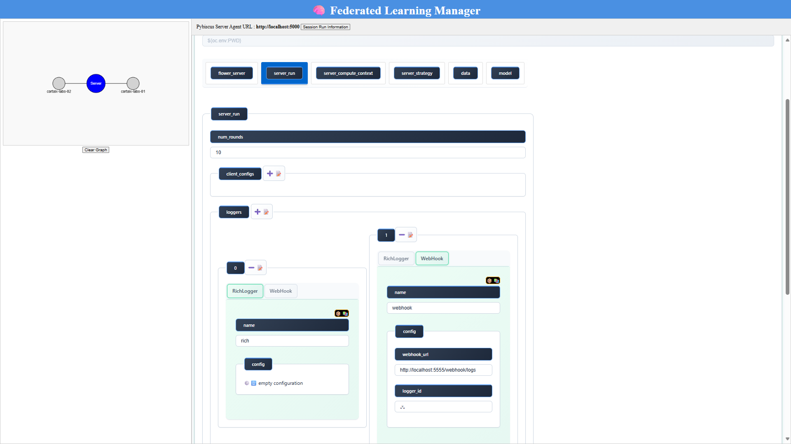
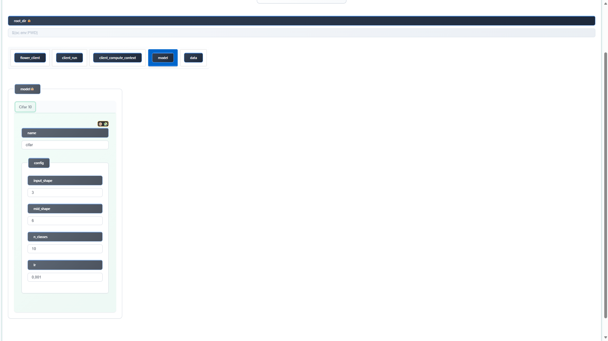
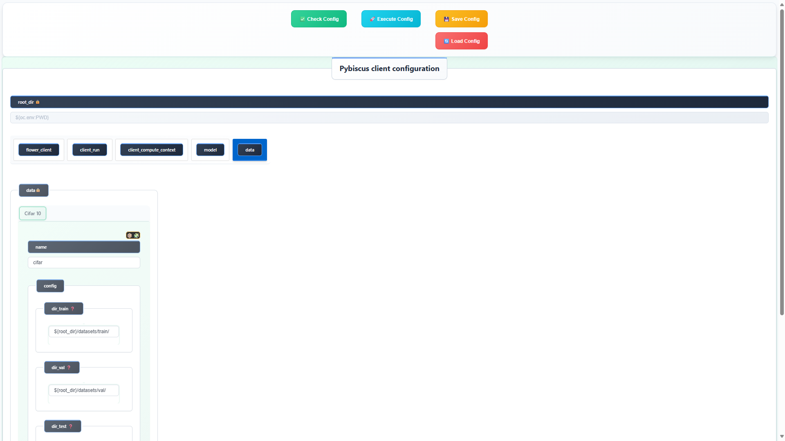

# Session using the manager

## Install Pybiscus
After cloning the repo and installing (via uv) all dependencies, you have to extend your PATH with the command:
```bash
source ./extend_path.sh
```

The session manager ensures consistency across federation participants, handles registration, synchronization, and shared settings.

### Init of the session : server side

launch the server agent :

```bash
 ./launch/agent/cli/5000.sh
```

launch the session manager :

```bash
./launch/session/run_manager.sh
```

connect to http://localhost:5555/manage

### Init of the session : client 1 side

launch the client1 agent :

```bash
 ./launch/agent/cli/5001.sh
```

connect to http://localhost:5001/session/client/registration


and the client 1 registers to the session

### Init of the session : client 2 side

launch the client2 agent :

```bash
 ./launch/agent/cli/5002.sh
```

connect to http://localhost:5002/session/client/registration

and the client 2 registers to the session

### Session shared parameters setting



Proceed to the session common parameters definition, then run the server,
it will present you its configuration webapp with the session common partameters set and locked (lock image in the field name)

For instance, configurate its metrics logging feature and logging feature to use a webhook :




Check and Execute the server configuration.

### Launch session monitoring

Then switch to "Session Run Information".


Notice that choices in clients are also restrained to common parameters (for data and models), and that server address and clients ids are set and locked.

### Session run : client 1 side

Check and Execute the client1 configuration.



### Session run : client 2 side

Check and Execute the client2 configuration.



You can see directly the logs and metrics in the session manager, instead of having to look in each agent terminal (as we configurate them to the web-hook option).

### Session monitoring 


