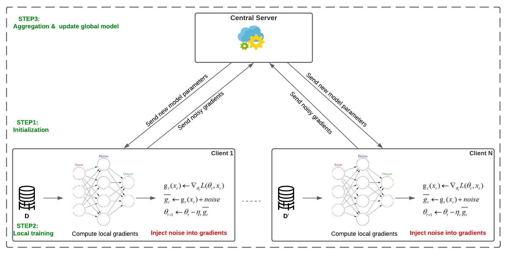
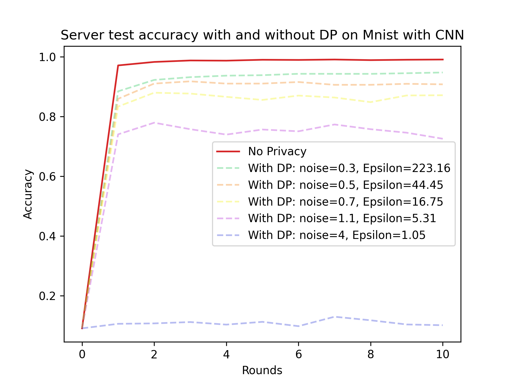
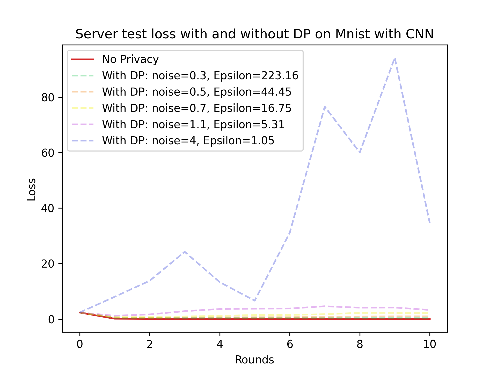

## This is an example of federated learning with Local Differential Privacy (DP-SGD).

Based on the following scheme, each client adds noise to the parameters they share with the server. This step helps ensure that their private data remains secure and protected.

We use Mnist dataset with an IID partition and a CNN model.  

NB_local_epoch=1, Nb_Rounds=10, len_train_data=30000. Delta=1e-5. 

run:

    python server.py
    python client1.py
    python client2.py

PS: Delta is generaly set to 1 / (number of training samples).

## Results:

)
