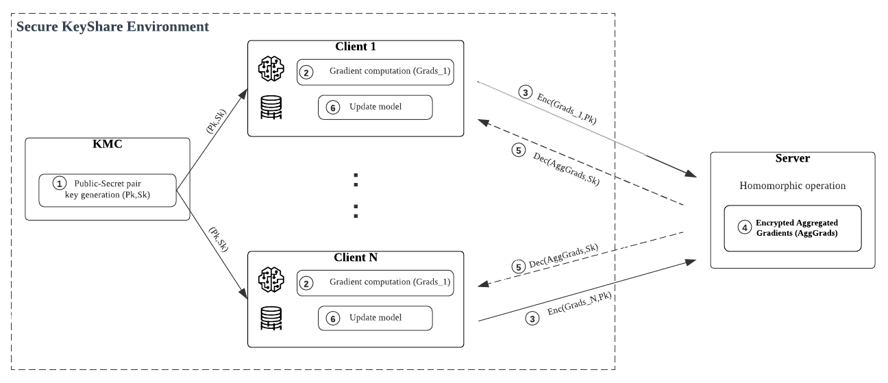

# This is an example of federated learning with Paillier homomorphic encryption using the flower framework. 

We use a Mnist NonIID partition with a Lenet model on the clients side. 

Clients can encrypt and decrypt thier local model parameters (encrypt & decrypt functions) using a Public-Secret key pair.

We define a server-side strategy called FedAvgHE, in which we aggregate the encrypted parameters sent by clients.

We use the [phe](https://pypi.org/project/phe/)  python library for Paillier-HE.

    python server.py
    python client1.py
    python client2.py
